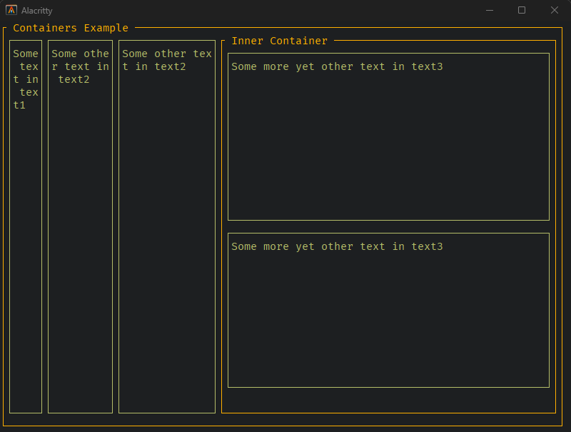

# Tooey (formerly termui)

See [FORK.MD](FORK.md) for details of the original fork and README.m

This started out as a fork then became a rewrite - Tooey exists now as a separate repo instead of a fork and this is being left for posterity.

See [tooey](https://github.com/asciifaceman/tooey)
